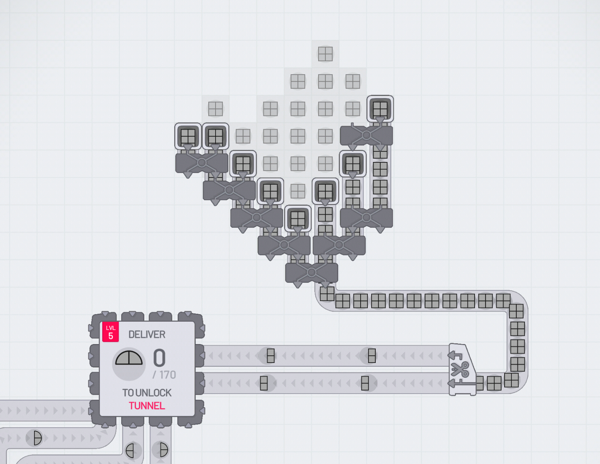

## Software development is shifting from code production to system verification and decision loops.

The first programming I ever did was on paper. No, I'm not old enough to have used punch cards and, no, I'm not talking about writing specs or even pseudocode. My first coding was in the pages of a small notebook, soon after I’d read a book about the BASIC programming language as a child. We didn’t have a computer I could program on, but that didn’t stop me filling the notebook. I made simple text adventure games, learning about variables, conditionals and loops, all with the BASIC syntax that I could read and understand. The syntax meant I knew a computer could, in theory, interpret it, even if most of the programs never left the page. I could read the special language and know that I wasn't creating nonsense, even if others couldn't see the programs execute.

The programming syntax was a clear separation between *understanding* the code and *executing* it.

Fast forward some decades and now, even as a software engineer, it's becoming rare that I need to know or apply specific syntax. AI coding agents now compile natural language into something machines can execute.

In early 2026, popular IDEs and other tooling are starting to support new workflows to manage *multiple* coding agents at once. We now have sub-agents, background agents, and even swarms of agents.

Working code can be produced orders of magnitude faster. Forget the 10X engineer, we should all be 100X engineers.

But we're not, are we?

The problem is that writing code is no longer the bottleneck in software delivery.

Studies continue to show only small percentage productivity improvements when organisations adopt AI. We can fill thousands of notebooks with working syntax faster than we can come up with good ideas. We still can’t get it in front of users.

My notebook of BASIC programs sets the scene but let's use another analogy to see what the issue is.

If you've ever played a factory sim game then you might have seen this before. You suddenly upgrade one slow process so that component is much faster. When this happens in isolation you see a big pile-up after the process and an empty queue before it. Everything else becomes the bottleneck. It can even feel like a wasted upgrade if you’re not seeing 100% utilisation.

If this isn't easy to visualise then give [Shapez.io](https://shapez.io/) a quick play.

## The new bottlenecks

This issue of managing bottlenecks is well studied. See things like the [Theory of Constraints](https://en.wikipedia.org/wiki/Theory_of_constraints), [Amdahl's Law](https://en.wikipedia.org/wiki/Amdahl%27s_law), and [Value-stream Mapping](https://en.wikipedia.org/wiki/Value-stream_mapping) that all come at it from different angles. One thing they have in common is first identifying what the bottleneck is.

Even without these frameworks and models, as the bottleneck of churning out working code is removed, the new bottlenecks become more visible.

Agent swarms optimise one step of the pipeline.

Let's have a quick review of the coding factory of 2026:

### Spec

Turning vague ideas into plans that will be effective. Agents *are* getting better at this but not as quickly as they're improving at coding. I've seen many posts claiming that writing good specs or PRDs will become the main job of a software engineer.

The direction we're going is to "shift left" everything (e.g. testing, security) so much that we're now erring towards Big Design Up Front.

### Build

Agents are already very quick at taking a spec written in natural language and translating it into the syntax of code. They're going to get quicker and more capable.

### Verify

We expect the translation of the spec to code to be imperfect. If the translation *was* perfect then that would mean that we have specs that we can execute directly: I don't think we're there yet. Instead, we have to test whether the code does the right thing. The test/verification has to be strong enough to give us confidence to ship it.

Even most forms of **vibe coding** (using agents without looking at the code they produce) have some form of verification, where the vibe coder has a look at what was built before it goes to production. We still have the "human in the loop".

In many teams, the verification step is now the most visible bottleneck. AI writes code faster than it can be read by humans. Reviewing AI-generated code in pull requests the same way we review human code doesn’t scale.

There are a few options here...

* property testing
* formal specs
* simulation environments
* synthetic users
* agent-based testing

My view is that something fundamental has to change, so that we can trust code without human review. Something for another blog post.

### Deploy

Deployment is where we're best at automation. Lots of organisations have streamlined the step of getting verified code into production to the point where a `git merge` is all that's needed.

### Observe

Even when our code stays the same, things change around it. We get users doing new things, scaling challenges and configuration that changes. Feature flags may also delay some verification until after deployment.

If the production system isn't doing what it should then we need an effective feedback loop so that it can be changed (whether that's by traditional automation or AI agents or humans).

Similar to verification (preventing things going wrong), observation (knowing when things are about to go wrong) has a few ways to speed it up...

* behaviour simulation
* automated regression environments
* autonomous monitoring agents
* system-level invariants

Verfification and observability are gradually becoming more computational.

### Coordinate

Communication and governance aren’t steps themselves, but they enable and constrain every other step in the factory. A fast build that waits three days for sign-off is still a three-day build. The softer the bottleneck, the harder it is to see and the harder it is to fix.

When one step is done, how do we quickly and effectively move on to the next? I expect AI could help significantly here but I'm yet to see much evidence of it.

Decisions need to be made throughout the pipeline. They're also needed before it even starts: if we have a software factory, what should we make with it?

## Going faster

In this post my aim is to set the scene and highlight the problem. I'm still exploring what solutions might work well. That said, I want to end this post with something that’s often missed.

We have 2 approaches to making systems go faster:

1. Look at the **component** that is the bottleneck. We can do this by adding capacity, improving parallelisation or removing waste.
2. Look at the **system**. This may let us avoid the bottleneck entirely or replace it with something radically different.

The first option is the obvious one and is probably what we're already doing if we follow [Continuous Improvement](https://en.wikipedia.org/wiki/Continual_improvement_process) or [Lean](https://en.wikipedia.org/wiki/Lean_manufacturing) principles.

The second option is less obvious and only happens when we get to an inflection point with technology.

A good historical example of this with software is when we stopped trying to ship CDs to users and instead distributed SaaS over the internet. The growth of broadband and browser capabilities like AJAX caused a paradigm shift. The bottleneck got routed around entirely. Nobody figured out how to ship CDs faster, they just stopped shipping CDs. SaaS with multiple deploys a day is now the norm. Shipping physical disks once a quarter or buying them from a computer store now sounds archaic.

Software development is changing right now. Whether you buy into the hype of AI or not, what we do now will inevitably seem archaic at some point in the future.

The 100X claim is incomplete. Speed at one stage doesn't translate to speed at the system level, until the system itself changes.
